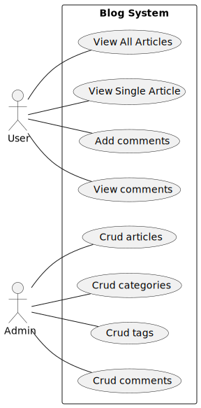

## **Blog app**

- Presented by:
  - SUIRITA Fahd
  - BOUGTOUB Samia
  - TRIBAK Ayoub
  - BAKALI Ayoub
- Framed by:
  - ESSARRAJ Fouad

---

### **1. Introduction**

---

### **2-2TUP Methodology:**

---

### **3. Planning:**

<table style="font-size: 38px" >
  <tr>
    <th></th>
    <th>1</th>
    <th>2</th>
    <th>3</th>
  </tr>
  <tr>
    <td>Monday</td>
    <td>Planning</td>
    <td>Prototype</td>
    <td>Installation</td>
  </tr>
  <tr>
    <td>Tuesday</td>
    <td>-</td>
    <td>-</td>
    <td>Analysis</td>
  </tr>
  <tr>
    <td>Wednesday</td>
    <td>Design</td>
    <td>Realization</td>
    <td>Realization</td>
  </tr>
  <tr>
    <td>Thursday</td>
    <td>Realization</td>
    <td>Realization</td>
    <td>Realization</td>
  </tr>
  <tr>
    <td>Friday</td>
    <td>Presentation</td>
    <td>Presentation</td>
    <td>-</td>
  </tr>
</table>

---

### **4. Analyse:**

---

### **5. Design:**

---

### **6. Learning:**

- laravel/ui
- spatie
- polymorphism

---

### **7. Prototype:**

- view articles
- add article
- delete article

---

### **8. Realization:**

---

### **9. Conclusion:**
